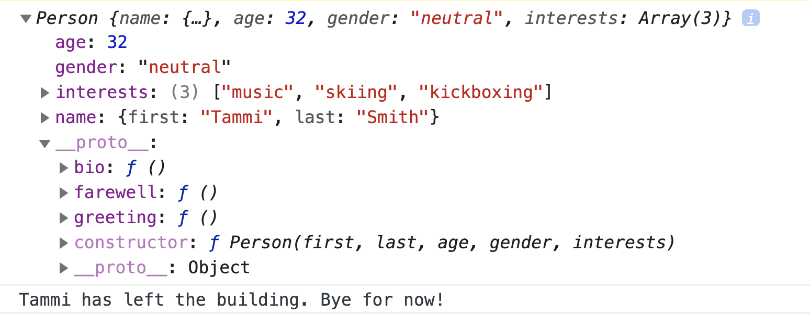
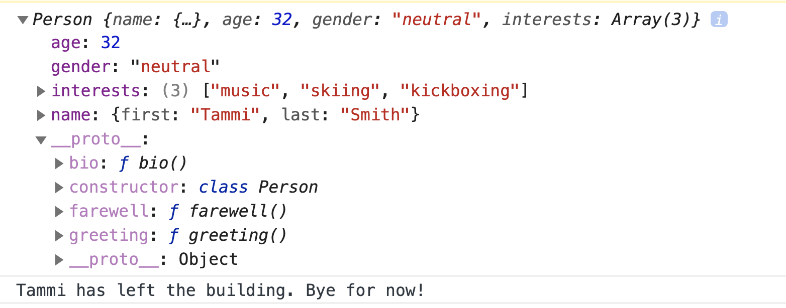

# Prototype

# Objectives

1. Explain Javascript is prototype-based language
1. Explain the usage of prototype 
1. Show prototype chain really exists
1. Explain Object.create() function
1. Explain Constructor function
1. Explain constructor with property definitions

## Introduction

> ### Javascript is a prototype-based language — to provide inheritance, objects can have a prototype object, which acts as a template object that it inherits methods and properties from.

Now let's define a `person` object. 

```javascript
let person = {
    name: 'Tiger',
    gender: 'male',
    age: 25,
    greeting () {
        console.log(`Hello ${this.name}`);
    }
};

person.greeting();
```

`this` is automatically bind to function scope, which is then the `person` object (block scope) when called on `person`. 

```javascript 
let person = {
    name: 'Tiger',
    gender: 'male',
    age: 25,
    greeting : () => {
        console.log(`Hello ${this.name}`);
    }
};

person.greeting();
```

Arrow function doesn't bind the scope to the function scope. Instead it refers to the global scope. So it will be undefined or window object.


Let's console.log `person` object.

```javascript
// What prototype person have?
console.log(person);
```

Let's open the browser console (or right click inspect) and see what was printed out. Expand the `person` object and see what's under? 

There is a `__proto__` key value pair under it. 

This is the `person` object's prototype.

## Prototype chain
`person` inherits from `Object.prototype`, the general ancestral prototype, the entity behind almost all objects. But not all methods from `Object` are inherited, only the ones defined on the prototype property are inherited (check `Object` documentation [MDN](https://developer.mozilla.org/en-US/docs/Web/JavaScript/Reference/Global_Objects/Object)).

The `person` object itself can be a prototype of other persons. Prototype is like a template or blueprint of a new object. We use method `Object.getPrototypeOf()` to get any object's prototype.

```javascript
console.log(Object.getPrototypeOf(person) === Object.prototype);
// → true
console.log(Object.getPrototypeOf(Object.prototype));
// → null
```

## Object.create() is to create a new object with the prototype being the object passed in.
When we use `Object.create(person)`, it will automatically create a new object inheriting from the `person` prototype. 

```javascript
// Person2 is created with the prototyper object === person
let hellen = Object.create(person);
hellen.name = 'Helen';

hellen.greeting();

console.log(Object.getPrototypeOf(hellen));
```
The last line will console.log `person`.

Therefore, hellen inherits from prototype `person`, and `person` inherits from prototype `Object`.


## Constructor function
So finally the most developers including me settled down to use constructor function to create a object. Inside constructor function you can define objects' properties, and use upper-case for the first character for function name as the convention for constructor function.

For example,

```javascript 
function Person (first, last, age, gender, interests) {
    this.name = {
        'first': first,
        'last': last
    };
    this.age = age;
    this.gender = gender;
    this.interests = interests;
}
```

Normally we define properties on `this` key word, which will automatically bind to the function scope and bind it will refer to the object created with the constructor function. And we use key word `New` to create a new object with constructor function with also its prototype. Constructor function has a prototype property, to which methods added will be available on all objects created from the constructor.

```javascript
Person.prototype.greeting = function () {
    console.log('Hi! I\'m ' + this.name.first + '.');
};

Person.prototype.farewell = function () {
    console.log(this.name.first + ' has left the building. Bye for now!');
};

let person1 = new Person('Tammi', 'Smith', 32, 'neutral', ['music', 'skiing', 'kickboxing']);

console.log(person1);
person1.farewell();
```

Observe `person1` structure, what's under `__proto__`?



## Class is just a syntactic sugar to prototype
```javascript 
class Person {
    constructor (first, last, age, gender, interests) {
        this.name = {
            'first': first,
            'last': last
        };
        this.age = age;
        this.gender = gender;
        this.interests = interests;
    }

    greeting () {
        console.log('Hi! I\'m ' + this.name.first + '.');
    }

    farewell () {
        console.log(this.name.first + ' has left the building. Bye for now!');
    }
    // bio function ...
    // ...
}

let person1 = new Person('Tammi', 'Smith', 32, 'neutral', ['music', 'skiing', 'kickboxing']);

console.log(person1);
person1.farewell();
```



## Exercises

Going through [Test your skills: Object-oriented JavaScript](https://developer.mozilla.org/en-US/docs/Learn/JavaScript/Objects/Test_your_skills:_Object-oriented_JavaScript).

## Hungry for More
Going through Online Book and its exercises [eloquentjavascript chapter 6](https://eloquentjavascript.net/06_object.html)